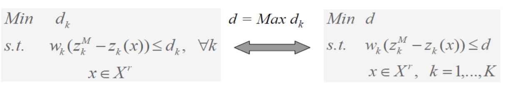

# Multi-Objective Decision Analysis (MODA): Progressive Articulation of Preferences with Method of Geoffrion, Interval Programming, and The Step Method

## Background and Motivation
Multiple-Objective Decision Analysis is a robust decision technique that evaluate objectives and measures in terms of value to select from a set of alternatives. The problem of MODA can be represents as follow.
$$Max/Min F(x)=[f_{1}(x),..,f_{k}(x),...,f_{K}(x)]$$
$$s.t. A=\{x|g_{i}(x)<\leq,=,\geq>0,i=1,...,m,x\geq, x \in R^{n}\}$$
$f_{k}(x)$ is a objective function. Through setting objective function, we could formulate the feasible solution region and get the set of feasible solution. Decision maker makes final decision from this valid set according to the preference decision maker. 
## Methodology
### STEM
The Step Method is mainly separated into three parts and we will introduce these in this section.
First, In order to construct a payoff table in following graph, we need to solve K linear programming constraints. Let $z_{k}^{M}$ be the optimal value and $z_{k}^{p}$ the objective function value of $x_{k}^{\*}$. In addition, we define $z_{k}^{m}=Min{z_{k}^{p}:p=1,2,...,K}$ and can construct payoff table as following graph.
$$Max z_{k}(x)=\sum_{j=1}^{n}c_{kj}x_{j} \quad k=1,2,....,K$$

Second, we need to find an nondominated solution which is nearest to the ideal point. So we need to use the following equation to minimize and find the optimal value $d_{k}$.

$$w_{i}=\frac{\alpha_{i}}{\sum_{i}\alpha_{i}}$$
$$where \quad \alpha_{i}=[\frac{r_{i.}^{\*}-r_{-i.}}{\sum_{k}r_{ik}^2}][\sum_{k}r_{ik}^2]^{\frac{1}{2}}, \text{for larger reward} \ r_{ik}$$

$$\quad \quad \quad \quad \alpha_{i}=[\frac{r_{-i.}-r_{i.}^{\*}}{r_{-i.}}][\sum_{k}{r_{ik}^2}]^{\frac{1}{2}}, \text{for smaller reward} \ r_{ik}$$

## Example and Applications
The Step method (STEM) is a progressive method in decision making. First, the matrix $r_{ik}$ is constructed by the collected data or subjective assessment. Through $r_{i}^{\*}$, we can decide the optimal action $a_{i}^{\*}$. However, it is usually an infeasible solution. Hence, the best choice is most close ideal action.

| attribute\Program | history cost $r_{i1}$ | GPLH $r_{i2}$ | replacement cost $r_{i3}$ | export value $r_{i4}$ | ideal value $a_{i.}^{\*}$ |
| ----------------- | :-------------------: | :-----------: | :-----------------------: | :--------------------: | :-----------------------: |
| Associativity | $\underline{1}$ | 2 | 4 | $5^{\*}$ | 5 |  
| Objectivity | $5^{\*}$ | 4 | 3 | $\underline{2}$ | 5 |
| Releasability | $\underline{1}$ | 3 | 4 | $5^{\*}$ | 5 |
| Measurability | $5^{\*}$ | $5^{\*}$ | $5^{\*}$ | $5^{\*}$ | 5 | 
| Comparable | $\underline{2}$ | 3 | $4^{\*}$ | $4^{\*}$ | 4 | 

$$\alpha_{1}=\frac{5-1}{5}(1+4+16+25)^{\frac{-1}{2}}=0.118 \quad w_{1}=0.118/0.387=0.31$$
$$\alpha_{2}=\frac{5-2}{5}(25+16+9+4)^{\frac{-1}{2}}=0.082 \quad w_{2}=0.082/0.387=0.21$$
$$\alpha_{3}=\frac{5-1}{5}(1+9+16+25)^{\frac{-1}{2}}=0.111 \quad w_{3}=0.112/0.387=0.29$$
$\quad \quad \quad \quad \alpha_{4}=0$
$$\alpha_{5}=\frac{4-2}{4}(4+9+16+16)^{\frac{-1}{2}}=0.075 \quad w_{5}=0.075/0.387=0.19$$
$\quad \quad \quad \quad \sum{\alpha_{i}}=0.387$
## Comments
Through using multiple objective linear programming, we can handle multiple objectives and know which solution is optimal.
## Reference
1. Lecture notes : Multi-Objective Decision Analysis
2. 王小璠，2005，多準則決策分析，滄海書局
